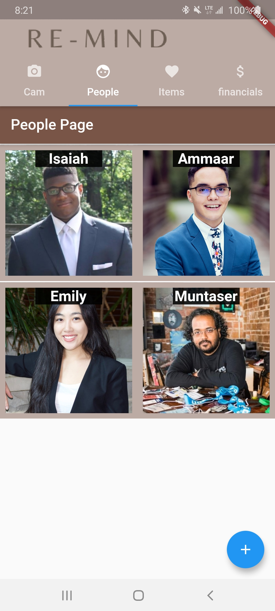
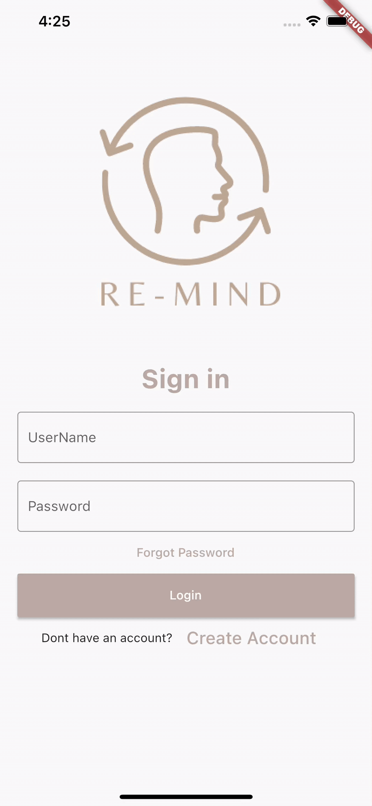

# Re-Mind
Put your head in the cloud.

A HackTheNorth2020++ mobile application designed to help those with Dementia.

## Getting Started
### Setup

In `backend/` import Azure `credentials.json` from [Microsoft Cognitive Services](https://azure.microsoft.com/en-us/services/cognitive-services/).
You'll need to add additional specific credentials for other cloud solutions (i.e. Azure CosmosDB, Azure Functions, etc.)

#### Environment
```bash
# Windows
set FLASK_APP=path
set FLASK_ENV=development
flask run

# Linux/ Unix
set FLASK_APP=path
set FLASK_ENV=development
flask run
```
where `path` is the absolute path of X.

### Screenshot(s)
<p align="center"></p>
<p align="center"></p>

### Example Person tracking
<p align="center"></p>

### Example Object tracking
<p align="center"></p>

### Developer Notes
Videos: 
